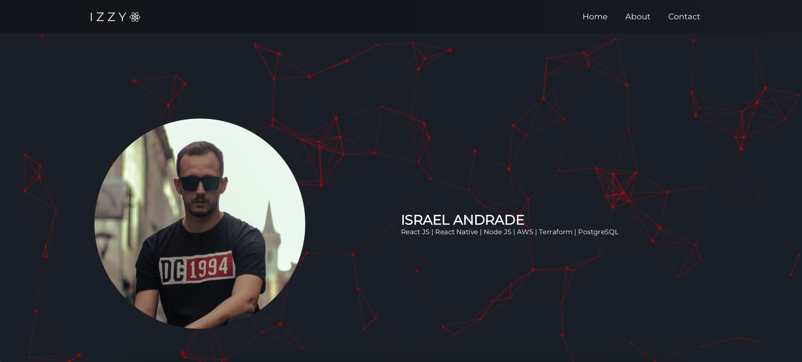

## Hey, welcome!

This is my personal portfolio.
I've made it public so you can take a look in the cool animation libraries I have used.
Hope you have a good time! 😄

## Available Scripts

In the project directory, you can run:

### `yarn start`

Runs the app in the development mode. 
Open [http://localhost:3000](http://localhost:3000) to view it in the browser.

The page will reload if you make edits. 
You will also see any lint errors in the console.
